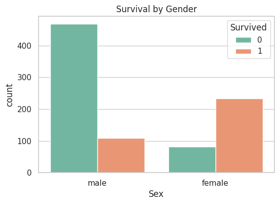
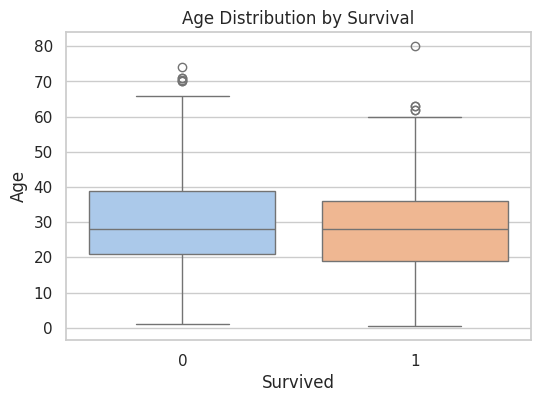
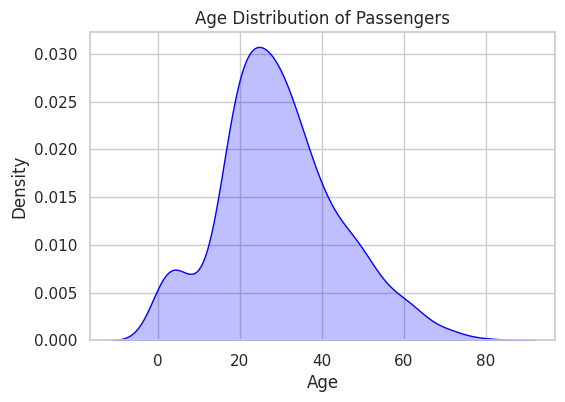
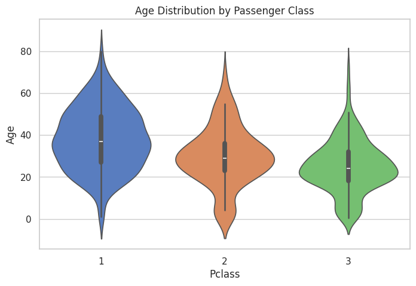
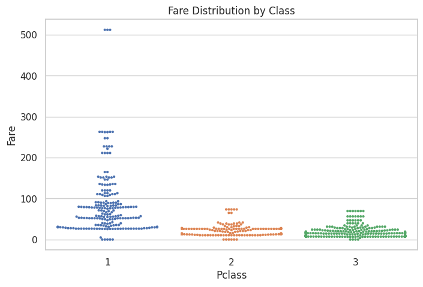

# Dataset Description:
The Titanic dataset is one of the most famous open datasets, provided by Kaggle. It contains information about passengers aboard the RMS Titanic, which sank on April 15, 1912, after hitting an iceberg.

The dataset is primarily used for data analysis, visualization, and machine learning classification tasks (predicting survival).

🔹 Files in the dataset:

train.csv → Training dataset with passenger details and their survival outcome.

test.csv → Similar structure but without survival information (used for prediction tasks).

gender_submission.csv → Sample submission file showing expected format.

🔹 Columns in train.csv:

PassengerId – Unique identifier for each passenger

Survived – Survival status (0 = Did not survive, 1 = Survived)

Pclass – Passenger class (1 = 1st class, 2 = 2nd class, 3 = 3rd class)

Name – Passenger’s full name

Sex – Gender of the passenger (male/female)

Age – Age in years

SibSp – Number of siblings/spouses aboard the Titanic

Parch – Number of parents/children aboard the Titanic

Ticket – Ticket number

Fare – Ticket fare

Cabin – Cabin number (many missing values)

Embarked – Port of embarkation (C = Cherbourg, Q = Queenstown, S = Southampton)

# Insights from Visualization
1. Bar Plot – Survival Count  
2. Bar Plot – Survival by Gender  
3. Box Plot – Age Distribution by Survival  
4. KDE Plot – Age Distribution of Passengers  
5. Violin Plot – Age Distribution by Passenger Class  
6. Swarm Plot – Fare Distribution by Class  

# Screenshots of Graphs
Here is Chart 1:

Here is Chart 2:

Here is Chart 1:

Here is Chart 3:

Here is Chart 4:

Here is Chart 5:

Here is Chart 6:

